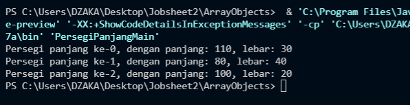
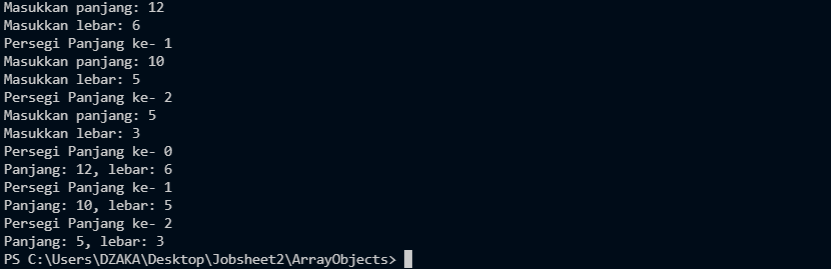
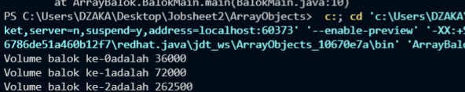
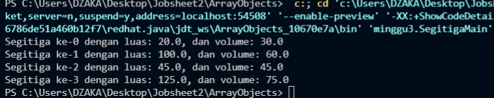
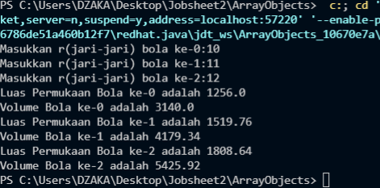
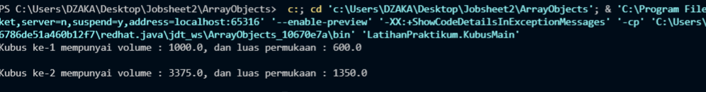
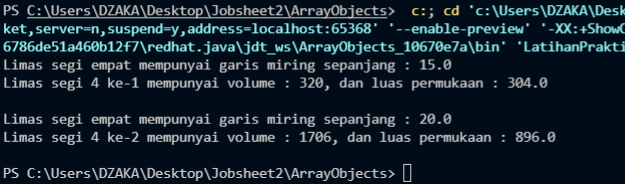
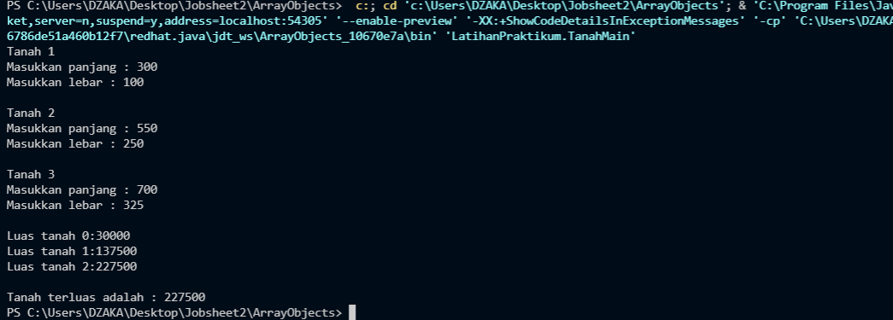
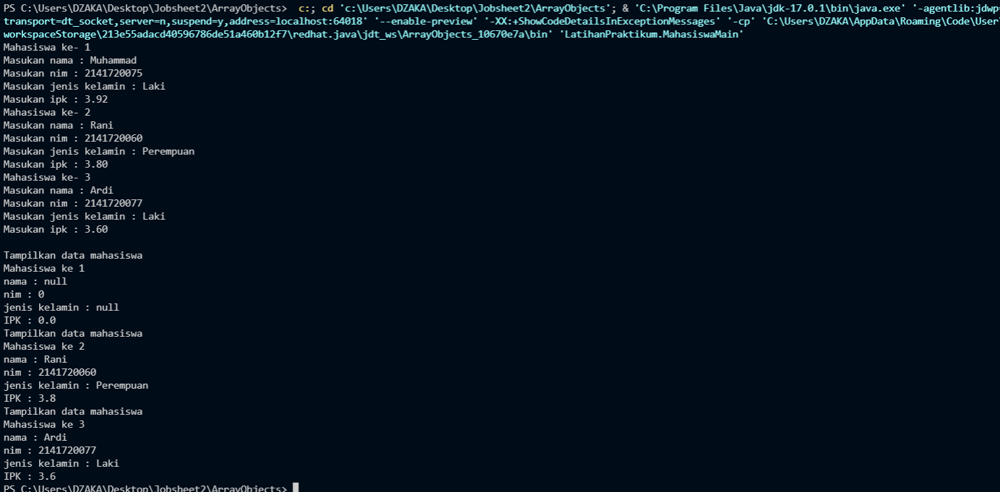

# JOBSHEET 3 ASD ARRAY OF OBJECTS
## Nama : Muhammad Dzaka Murran Rusid 
## Kelas : 1F_D4-TI

### 3.1 Tujuan Praktikum
Setelah melakukan materi praktikum ini, mahasiswa mampu:
1. Memahami dan menjelaskan fungsi array yang berisikan variabel objek.
2. Mahasiswa mampu menangkap logika tentang permasalahan array of object dalam Java
3. Mahasiswa mampu menerapkan pembuatan array of object dalam Java

### 3.2 Membuat Array dari Object, Mengisi dan Menampilkan
Didalam praktikum ini, kita akan mempraktekkan bagaimana membuat array dari object, 
kemudian mengisi dan menampilkan array tersebut.
#### 3.2.1 Langkah-langkah Percobaan
1. Buat Project baru, dengan nama “ArrayObjects”. Buat package dengan nama minggu3.
2. Buat class PersegiPanjang:
3. Pada fungsi main yaitu pada class ArrayObjects, buatlah array PersegiPanjang yang berisi 3 
elemen:
4. Kemudian isikan masing-masing atributnya:
5. Cetak ke layar semua atribut dari objek ppArray:
6. Jalankan dan amati hasilnya.
<br> <br>
**class code**
```java
public class PersegiPanjang {
    public int panjang;
    public int lebar;

}

```
<br>**class main code**

```java
public class PersegiPanjangMain {
    public static void main(String[] args){
        PersegiPanjang[] ppArray = new PersegiPanjang[3];
        ppArray[0] = new PersegiPanjang();
        ppArray[0].panjang = 110;
        ppArray[0].lebar = 30;

        ppArray[1] = new PersegiPanjang();
        ppArray[1].panjang = 80;
        ppArray[1].lebar = 40;

        ppArray[2] = new PersegiPanjang();
        ppArray[2].panjang = 100;
        ppArray[2].lebar = 20;

        System.out.println("Persegi panjang ke-0, dengan panjang: " +ppArray[0].panjang+ ", lebar: "+ ppArray[0].lebar);
        System.out.println("Persegi panjang ke-1, dengan panjang: " +ppArray[1].panjang+ ", lebar: "+ ppArray[1].lebar);
        System.out.println("Persegi panjang ke-2, dengan panjang: " +ppArray[2].panjang+ ", lebar: "+ ppArray[2].lebar);
    }
}
```
#### 3.2.2 Verifikasi Hasil Percobaan

<br>

#### 3.2.3 Pertanyaan
1. Berdasarkan uji coba 3.2, apakah class yang akan dibuat array of object harus selalu memiliki atribut dan sekaligus method?Jelaskan! 
<br>***Jawaban: Tidak, karena terlihat di percobaan 3.2 hanya class dan atribut yang dimasukkan, tidak ada method, tetapi program masih bisa jalan. Hal tersebut karena dalam program tersebut output yang diperlukan hanyalah menampilkan kembali nilai dari atribut panjang dan lebar.***
2. Apakah class PersegiPanjang memiliki konstruktor?Jika tidak, kenapa dilakukan pemanggilan konstruktur pada baris program berikut :
<br>***Tidak, pemanggilan dilakukan untuk mendapatkan atribut panjang dan lebar yang telah diinisialisasikan di class PersegiPanjang.***
3. Apa yang dimaksud dengan kode berikut ini:
```java
PersegiPanjang[] ppArray = new PersegiPanjang[3];
```
***Jawaban: Kode tersebut digunakan untuk menginstansiasi objek array bernama ppArray dari class PersegiPanjang yang memiliki total element 3***
<br>4. Apa yang dimaksud dengan kode berikut ini:
```java
 ppArray[1] = new PersegiPanjang();
        ppArray[1].panjang = 80;
        ppArray[1].lebar = 40;
```
***kode tersebut digunakan untuk mengisi nilai atribut dari element 2 (indeks 1) dari array ppArray[] dengan 80 dan 40.***
<br>5. Mengapa class main dan juga class PersegiPanjang dipisahkan pada uji coba 3.2?
<br>
***Karena class PersegiPanjang berfungsi sebagai template/dasar dari class main, sedangkan class main digunakan untuk di-run sehingga keduanya harus terpisah***
<br>
### 3.3 Menerima Input Isian Array Menggunakan Looping
Pada praktikum ini kita akan mengubah hasil program dari praktikum 3.2 sehingga program dapat 
menerima input dan menggunakan looping untuk mengisikan atribut dari semua persegi panjang yang 
ada di ppArray.
#### 3.3.1 Langkah-langkah Percobaan
1. Import scanner pada class ArrayObjects
2. Pada praktikum 3.2 poin nomor 4, ganti kodenya dengan kode berikut ini, yaitu membuat objek 
Scanner untuk menerima input, kemudian melakukan looping untuk menerima input:
3. Pada praktikum 3.2 poin nomor 5, ganti kodenya dengan berikut ini, yaitu melakukan looping 
untuk mengakses isi array ppArray dan menampilkannya ke layar: 
4. Jalankan dan amati hasilnya.
<br>
**code class main**
```java
import java.util.Scanner;
public class PersegiPanjangMain {
    public static void main(String[] args){        
        PersegiPanjang[] ppArray = new PersegiPanjang[3];
        Scanner sc = new Scanner(System.in);
        for(int i=0;i<3;i++){
            ppArray[i] = new PersegiPanjang();
            System.out.println("Persegi Panjang ke- "+i);
            System.out.print("Masukkan panjang: ");
            ppArray[i].panjang = sc.nextInt();
            System.out.print("Masukkan lebar: ");
            ppArray[i].lebar = sc.nextInt();
        }
        for(int i=0;i<3;i++){
            System.out.println("Persegi Panjang ke- "+i);
            System.out.println("Panjang: " +ppArray[i].panjang+ ", lebar: "+ppArray[i].lebar);
        }
    }
}
```

#### 3.3.2 Verifikasi Hasil Percobaan

<br>

#### 3.3.3 Pertanyaan
1. Apakah array of object dapat diimplementasikan pada array 2 Dimensi?
<br>***Bisa, karena konsep array tetap sama walau dilakukan di pemrograman berbasis objek maupun prosedural.***
2. Jika jawaban soal no satu iya, berikan contohnya! Jika tidak, jelaskan! 
```java
public class PersegiPanjangMain {
    public static void main(String[] args){
        PersegiPanjang[] ppArray = new PersegiPanjang[2][2];
        ppArray[0][0] = new PersegiPanjang();
        ppArray[0][0].panjang = 110;
        ppArray[0][0].lebar = 30;

        ppArray[0][1] = new PersegiPanjang();
        ppArray[0][1].panjang = 80;
        ppArray[0][1].lebar = 40;

        ppArray[0][2] = new PersegiPanjang();
        ppArray[0][2].panjang = 100;
        ppArray[0][2].lebar = 20;
```
3. Jika diketahui terdapat class Persegi yang memiliki atribut sisi bertipe integer, maka kode dibawah ini akan memunculkan error saat dijalankan. Mengapa?
```java
Persegi[] pgArray = new Persegi[100];
pgArray[5].sisi = 20;
```

***Jawaban: Karena proses pemberian nilai pada array tersebut 
tidak didahului pembuatan objek Persegi pada ppArray indeks ke-5 seperti ppArray[5] = new Persegi();***
<br>4. Modifikasi kode program pada praktikum 3.3 agar length array menjadi inputan dengan Scanner!
<br>***Jawaban:***
```java
import java.util.Scanner;
public class PersegiPanjangMain {
    public static void main(String[] args){        
        PersegiPanjang[] ppArray = new PersegiPanjang[3];
        Scanner sc = new Scanner(System.in);
        for(int i=0;i<ppArray.length;i++){
            ppArray[i] = new PersegiPanjang();
            System.out.println("Persegi Panjang ke- "+i);
            System.out.print("Masukkan panjang: ");
            ppArray[i].panjang = sc.nextInt();
            System.out.print("Masukkan lebar: ");
            ppArray[i].lebar = sc.nextInt();
        }
        for(int i=0;i<ppArray.length;i++){
            System.out.println("Persegi Panjang ke- "+i);
            System.out.println("Panjang: " +ppArray[i].panjang+ ", lebar: "+ppArray[i].lebar);
        }
    }
}
```
<br>5. Apakah boleh Jika terjadi duplikasi instansiasi array of objek, misalkan saja instansiasi dilakukan 
pada ppArray[i] sekaligus ppArray[0]?Jelaskan !
<br>***Jawaban: Tidak bisa, karena program akan mendeteksi duplikat variabel dari instansiasi keduanya, sehingga muncul error duplikat lokal variabel.***
### 3.4 Operasi Matematika Atribut Object Array
Pada praktikum ini kita akan melakukan pengoperasian matematika beberapa atribut pada 
masing-masing anggota array.
#### 3.4.1 Langkah-langkah Percobaan
1. Buat package baru “ArrayBalok”.
2. Buat class Balok:
3. Pada fungsi main yaitu pada class ArrayBalok, buat array Balok yang berisi 3 elemen:
4. Kemudian tambahkan kode berikut ini untuk mengisi array blArray menggunakan konstruktor 
dari class Balok:
5. Tampilkan semua volume balok tersebut dengan cara memanggil method hitungVolume() di 
dalam looping seperti berikut ini:
6. Jalankan dan amati hasilnya
<br>**code class**
```java
package ArrayBalok;

public class Balok {
    public int panjang;
    public int lebar;
    public int tinggi;

    public Balok(int p, int l, int t){
        panjang=p;
        lebar=l;
        tinggi=t;
    }

    public int hitungVolume(){
        return panjang*lebar*tinggi;
    }
}
```
<br>**code main class**
```java
package ArrayBalok;

public class BalokMain {
    public static void main(String[] args){
        Balok[] blArray = new Balok[3];
        blArray[0] = new Balok(100, 30, 12);
        blArray[1] = new Balok(120, 40, 15);
        blArray[2] = new Balok(210, 50, 25);
        for(int i=0;i<3;i++){
            System.out.println("Volume balok ke-"+i+"adalah "+blArray[i].hitungVolume());
        }
    }
}

```
#### 3.4.2 Verifikasi Hasil Percobaan


#### 3.4.3 Pertanyaan
1. Dapatkah konstruktor berjumlah lebih dalam satu kelas? Jelaskan dengan contoh!
<br>***Jawaban: Bisa, konstruktor dapat berjumlah berapapun sesuai kebutuhan. Contoh:***
```java
package ArrayBalok;

public class Balok {
    public int panjang;
    public int lebar;
    public int tinggi;
    public int sisi1, sisi2;

    public Balok(){

    }
    
    public Balok(int p, int l, int t){
        panjang=p;
        lebar=l;
        tinggi=t;
    }

    public Balok(int s1, int s2){
        sisi1=s1
        sisi2=s2
    }

    public int hitungVolume(){
        return panjang*lebar*tinggi;
    }
}
```
2. Jika diketahui terdapat class Segitiga seperti berikut ini:
Tambahkan konstruktor pada class Segitiga tersebut yang berisi parameter int a, int t yang masing-masing digunakan untuk mengisikan atribut alas dan tinggi.
```java
public class Segitiga{
    public int alas;
    public int tinggi;
}
```
3. Tambahkan method hitungLuas() dan hitungKeliling() pada class Segitiga
tersebut.
4. Pada fungsi main, buat array Segitiga sgArray yang berisi 4 elemen, isikan masing-masing atributnya sebagai berikut:
<br>sgArray ke-0 alas: 10, tinggi: 4
<br>sgArray ke-1 alas: 20, tinggi: 10
<br>sgArray ke-2 alas: 15, tinggi: 6
<br>sgArray ke-3 alas: 25, tinggi: 10
5. Kemudian menggunakan looping, cetak luas dan keliling dengan cara memanggil method 
hitungLuas() dan hitungKeliling()
<br>**HASIL CLASS SEGITIGA**
<br>**code class**
```java
package minggu3;

public class Segitiga {
    public int alas;
    public int tinggi;

    public Segitiga(int a, int t){
        alas=a;
        tinggi=t;
    }
    
    public float hitungLuas(){
        return alas*tinggi/2;
    }
    
    public float hitungVolume(){
        return alas+alas+alas;
    }
}
```
<br>**code main class**
```java
package minggu3;

public class SegitigaMain {
    public static void main(String[] args){
    Segitiga[] sgArray = new Segitiga[4];
    sgArray[0] = new Segitiga(10,4);
    sgArray[1] = new Segitiga(20,10);
    sgArray[2] = new Segitiga(15,6);
    sgArray[3] = new Segitiga(25,10);
    for(int i=0;i<sgArray.length;i++){
        sgArray[i].hitungLuas();
        sgArray[i].hitungVolume();
        System.out.println("Segitiga ke-"+i+" dengan luas: "+sgArray[i].hitungLuas()+ ", dan volume: "+ sgArray[i].hitungVolume());
    }
    }
    }
```
<br>**OUTPUT**
<br>

<br>

### 3.5 Latihan Praktikum
1. Buatlah program yang dapat menghitung luas permukaan dan volume beberapa bangun ruang 
(minimal 3, jenis bangun luas bebas). Buatlah 3 (tiga) class sesuai dengan jumlah jenis bangun 
ruang. Dan buat satu main class untuk membuat array of objek yang menginputkan atribut-atribut 
yang ada menggunakan konstruktor semua bangun ruang tersebut. 
Keterangan : Buat looping untuk menginputkan masing-masing atributnya, kemudian tampilkan 
luas permukaan dan volume dari tiap jenis bangun ruang tersebut.
<br>***Jawaban:***
<br>***BOLA***
```java
package LatihanPraktikum; \\CLASS CODE
    public class Bola {
        public int jari;
        
        public Bola(){
            
        }
        
        public double hitungVolume(){
            return 4/3*3.14*(jari*jari*jari);
        }

        public double hitungLuasP(){
            return 4*3.14*(jari*jari);
        }
    }
    
```
```java
package LatihanPraktikum; \\MAIN CLASS CODE
import java.util.Scanner;
public class BolaMain {
    public static void main(String[] args){
    Scanner sc = new Scanner(System.in);
    Bola[] blArray = new Bola[3];
    for(int i=0;i<blArray.length;i++){
        blArray[i] = new Bola();
        System.out.print("Masukkan r(jari-jari) bola ke-"+i+":");
        blArray[i].jari = sc.nextInt();
    }
    for(int i=0;i<blArray.length;i++){
        System.out.println("Luas Permukaan Bola ke-"+i+" adalah "+blArray[i].hitungLuasP());
        System.out.println("Volume Bola ke-"+i+" adalah "+ blArray[i].hitungVolume());
    }
    }    
}
```

<br>

***KUBUS***

```java
package LatihanPraktikum; \\CLASS CODE

public class Kubus {
        public int sisi;
    
        public Kubus(int s) {
            sisi = s;
        }
    
        public double hitungVolume(){
            return sisi*sisi*sisi;
        }
    
        public double hitungLuasP(){
            return 6*(sisi*sisi);
        }
}
```
```java
package LatihanPraktikum;

public class KubusMain {
    public static void main(String[] args) {
        Kubus[] kArray = new Kubus[2];

        kArray[0] = new Kubus(10);
        kArray[1] = new Kubus(15);

        for(int i = 0;i < 2;i++){
            System.out.println("Kubus ke-"+(i+1)+" mempunyai volume : "+kArray[i].hitungVolume()+", dan luas permukaan : "+kArray[i].hitungLuasP());
            System.out.println(" ");
        }
    }
}
```
**OUTPUT**


***LIMAS SEGIEMPAT***
```java
package LatihanPraktikum; \\CLASS CODE

public class LimasSegi4 { 
    public int sisA, tinggi, c;

    public LimasSegi4(int sa, int t){
        sisA = sa;
        tinggi = t;
    }

    public void cariC(){
        c = ((1/2*sisA*1/2*sisA)+(tinggi*tinggi));
        System.out.println("Limas segi empat mempunyai garis miring sepanjang : "+(Math.sqrt(c)));
    }
    
    public int hitungVolume(){
        return sisA*sisA*tinggi/3;
    }

    public Double hitungLuasP(){
        return (sisA*sisA)+(4*sisA*(Math.sqrt(c))/2);
    }
}

```
```java
package LatihanPraktikum; \\MAIN CLASS CODE

public class LimasSegi4Main {
    public static void main(String[] args) {
        LimasSegi4[] lsArray = new LimasSegi4[2];

        lsArray[0] = new LimasSegi4(8, 15);
        lsArray[1] = new LimasSegi4(16, 20);

        for(int i = 0;i < 2;i++){
            lsArray[i].cariC();
            System.out.println("Limas segi 4 ke-"+(i+1)+" mempunyai volume : "+lsArray[i].hitungVolume()+", dan luas permukaan : "+lsArray[i].hitungLuasP());
            System.out.println(" ");
        }
    }
```
**OUTPUT**


<br>2. Sebuah perusahaan jual beli tanah membutuhkan sebuah program yang dapat memberitahu luas 
tanah. Program tersebut dapat menerima input jumlah tanah yang akan dihitung dan atribut panjang dan lebar masing-masing dari tanah yang diinputkan. Program dapat menampilkan luas 
tanah masing-masing tanah yang diinputkan tadi dan juga tanah terluas dari ketiga tanah yang 
ada. Contoh output program:
Jumlah tanah: 3
Tanah 1
Panjang: 100
Lebar: 40
Tanah 2
Panjang: 250
Lebar: 100
Tanah 3
Panjang: 120
Lebar: 100
Luas Tanah 1: 4000
Luas Tanah 2: 25000
Luas Tanah 3: 12000
Tanah terluas: Tanah 2
<br>***Jawaban:***
```java
package LatihanPraktikum; \\CLASS CODE

public class Tanah {
    public int panjang,lebar;

    public int hitungLuas(){
        return panjang*lebar;
    }
```
```java
package LatihanPraktikum; \\MAIN CLASS CODE
import java.util.Scanner;
public class TanahMain {
    public static void main(String[] args) {
        Tanah[] tArray = new Tanah[3];
        Scanner sc = new Scanner(System.in);

        for(int i = 0; i < 3;i++){
            tArray[i] = new Tanah();
            System.out.println("Tanah "+(i+1));
            System.out.print("Masukkan panjang : ");
            tArray[i].panjang = sc.nextInt();
            System.out.print("Masukkan lebar : ");
            tArray[i].lebar = sc.nextInt();
            System.out.println(" ");
        }

        for(int i = 0; i < 3;i++){
            System.out.println("Luas tanah "+i+ ":" +tArray[i].hitungLuas());
        }System.out.println(" ");

        int highest = tArray[0].hitungLuas();

        for(int i = 0;i<3;i++){
            if(tArray[i].hitungLuas() > highest) highest = tArray[i].hitungLuas();
        }System.out.println("Tanah terluas adalah : "+highest);
    }
}
```
**OUTPUT**

<br><br>3. Sebuah kampus membutuhkan program untuk menampilkan informasi mahasiswa berupa nama, 
nim, jenis kelamin dan juga IPK mahasiswa. Program dapat menerima input semua informasi 
tersebut, kemudian menampilkanya kembali ke user. Implementasikan program tersebut jika 
dimisalkan terdapat 3 data mahasiswa yang tersedia. Contoh output program:
Masukkan data mahasiswa ke- 1
Masukkan nama :Rina
Masukkan nim :1234567
Masukkan jenis kelamin :P
Masukkan IPK :3.5
Masukkan data mahasiswa ke- 2
Masukkan nama :Rio
Masukkan nim :7654321
Masukkan jenis kelamin :L
Masukkan IPK :4.0
Masukkan data mahasiswa ke- 3
Masukkan nama :Reza
Masukkan nim :8765398
Masukkan jenis kelamin :L
Masukkan IPK :3.8
Data Mahasiswa ke-1
nama : Rina
nim : 1234567
Jenis kelamin : P
Nilai IPK : 3.5
Data Mahasiswa ke-2
nama : Rio
nim : 7654321
Jenis kelamin : L
Nilai IPK : 4.0
Data Mahasiswa ke-3
nama : Reza
nim : 8765398
Jenis kelamin : L
Nilai IPK : 3.
<br>***Jawaban:***
```java
package LatihanPraktikum; \\CLASS CODE

public class Mahasiswa {
    public String nama, kelamin;
    public int nim;
    public double ipk;
}
```
```java
package LatihanPraktikum; \\MAIN CLASS CODE
import java.util.Scanner;

public class MahasiswaMain {
    public static void main(String[] args) {
        Mahasiswa[] array = new Mahasiswa[3];
        Scanner sc = new Scanner(System.in);

        for(int i = 0; i < 3; i++){
            array[i] = new Mahasiswa();
            array[0] = new Mahasiswa();
            System.out.println("Mahasiswa ke- "+(i+1));
            System.out.print("Masukan nama : ");
            array[i].nama = sc.next();
            System.out.print("Masukan nim : ");
            array[i].nim = sc.nextInt();
            System.out.print("Masukan jenis kelamin : ");
            array[i].kelamin = sc.next();
            System.out.print("Masukan ipk : ");
            array[i].ipk = sc.nextDouble();
        }System.out.println(" ");

        for(int i = 0;i < 3;i++){
            System.out.println("Tampilkan data mahasiswa");
            System.out.println("Mahasiswa ke "+(i+1));
            System.out.println("nama : "+array[i].nama);
            System.out.println("nim : "+array[i].nim);
            System.out.println("jenis kelamin : "+array[i].kelamin);
            System.out.println("IPK : "+array[i].ipk);
        }
    }
}
```
<br>**OUTPUT**
